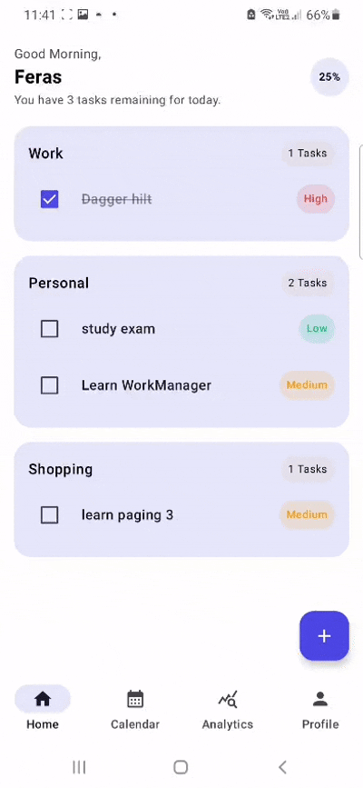
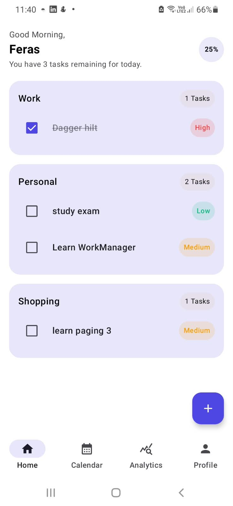
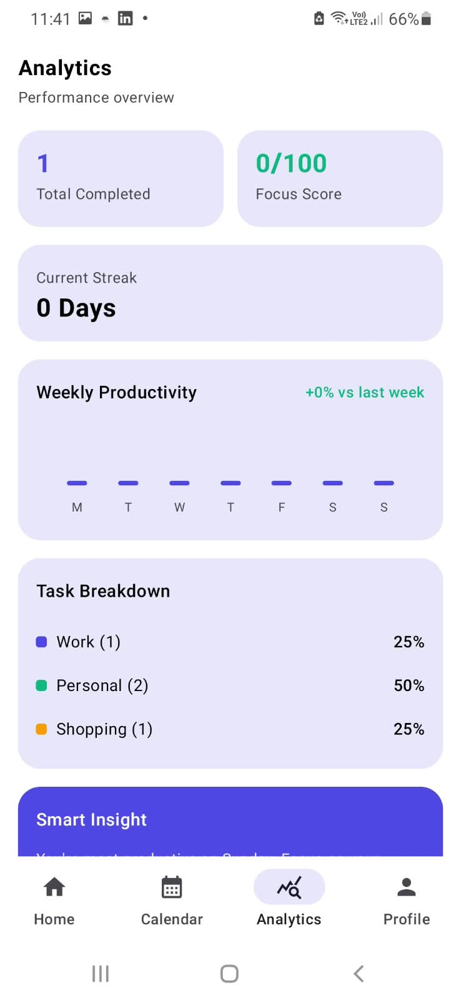
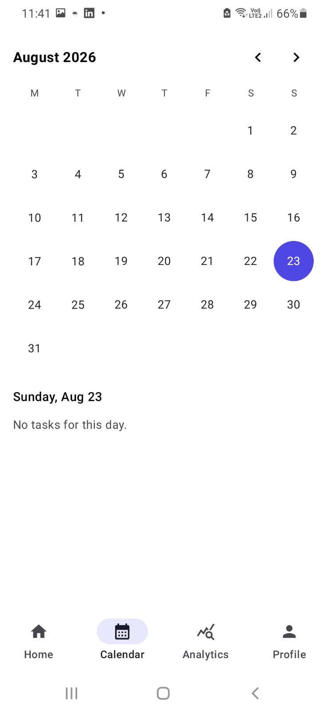
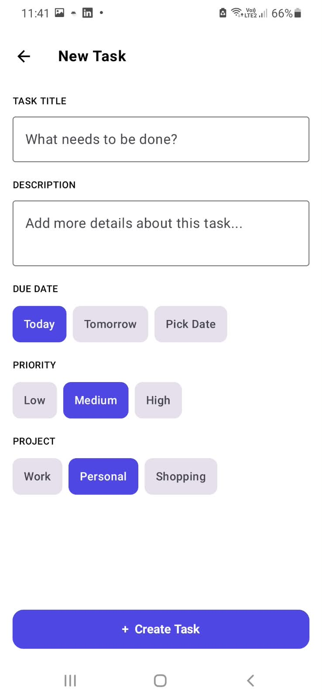

# TaskFlow

A modern Android task management application built with Kotlin and Jetpack Compose.

## 📱 Features

- Create and manage tasks
- Mark tasks as completed
- Task due dates
- Daily reminders
- Dark / Light mode
- Local data persistence
- User profile
- Background task scheduling

## 🛠 Tech Stack

- Kotlin
- Jetpack Compose
- MVVM
- Hilt / Dependency Injection
- Room
- WorkManager
- DataStore
- Navigation Compose
- Coroutines & Flow
- KSP
- Gradle Version Catalogs

## 🏗 Architecture

TaskFlow follows a layered architecture:

Presentation
↓
ViewModel
↓
Repository
↓
Room / Data Source

## ⏰ Background Work

WorkManager is used to periodically check pending tasks and send reminder notifications.

## 🎨 UI

Built entirely with Jetpack Compose and Material 3.

## 📦 Project Structure

app/
├── data/
├── domain/
├── presentation/
├── di/
└── ...

## 🚀 Getting Started

1. Clone the repository
2. Open the project in Android Studio
3. Sync Gradle
4. Run the application

## 📸 Screenshots

| Home | Analytics |
|------|------|
|  |  |

| Calendar | add task |
|-------------|---------|
|  |  | 

## 📚 What I Learned

- Building Android applications with Jetpack Compose
- MVVM and repository architecture
- Dependency Injection with Hilt
- Local persistence with Room
- Background processing with WorkManager
- Managing application state with StateFlow
- Working with Kotlin Coroutines

## 🧪 Testing

TaskFlow includes automated tests covering different layers of the application.

### Unit Testing

- JUnit
- Mockito-Kotlin
- ViewModel testing
- Repository testing
- Business logic testing

### Instrumented Testing

- AndroidX JUnit
- AndroidX Espresso
- Hilt Android Testing

### Testing Approach

The project separates testing responsibilities between:

- **Unit Tests** — testing business logic, ViewModels, and repositories without requiring a physical device.
- **Instrumented Tests** — testing Android-specific components and application behavior on an Android environment.
- **Dependency Injection Testing** — using Hilt's testing utilities to provide test dependencies.

### Test Technologies

- JUnit
- Mockito-Kotlin
- AndroidX JUnit
- Espresso
- Hilt Android Testing

## 👨‍💻 Author

Firas
